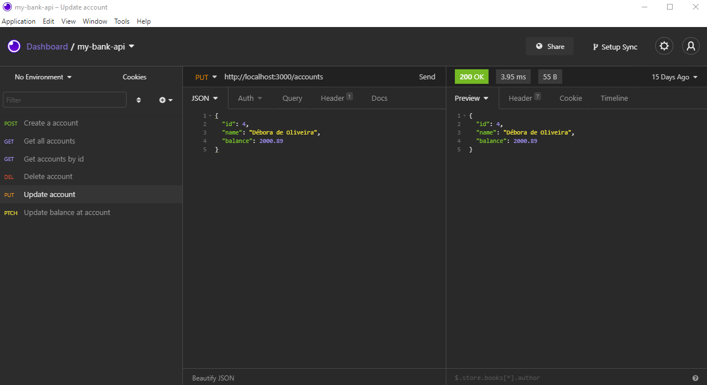

# my-bank-api
A Bootacamp IGTI API exercise API built with Node.js, Express, Cors and Winston modules.

### setup
install dependencies<br/>
```shell
# Clone the branch
git clone https://github.com/fagnerlopes/my-bank-api.git

cd my-bank-api

npm install

# Open a second terminal window and run:
nodemon index.js
```

The app will run on http://127.0.0.1:3000<br/>


### Tech stack

* 
* 
* 


Base URL: <http://localhost:3000/accounts>

### Documentation

URL: <http://localhost:3000/doc>


<br/>



