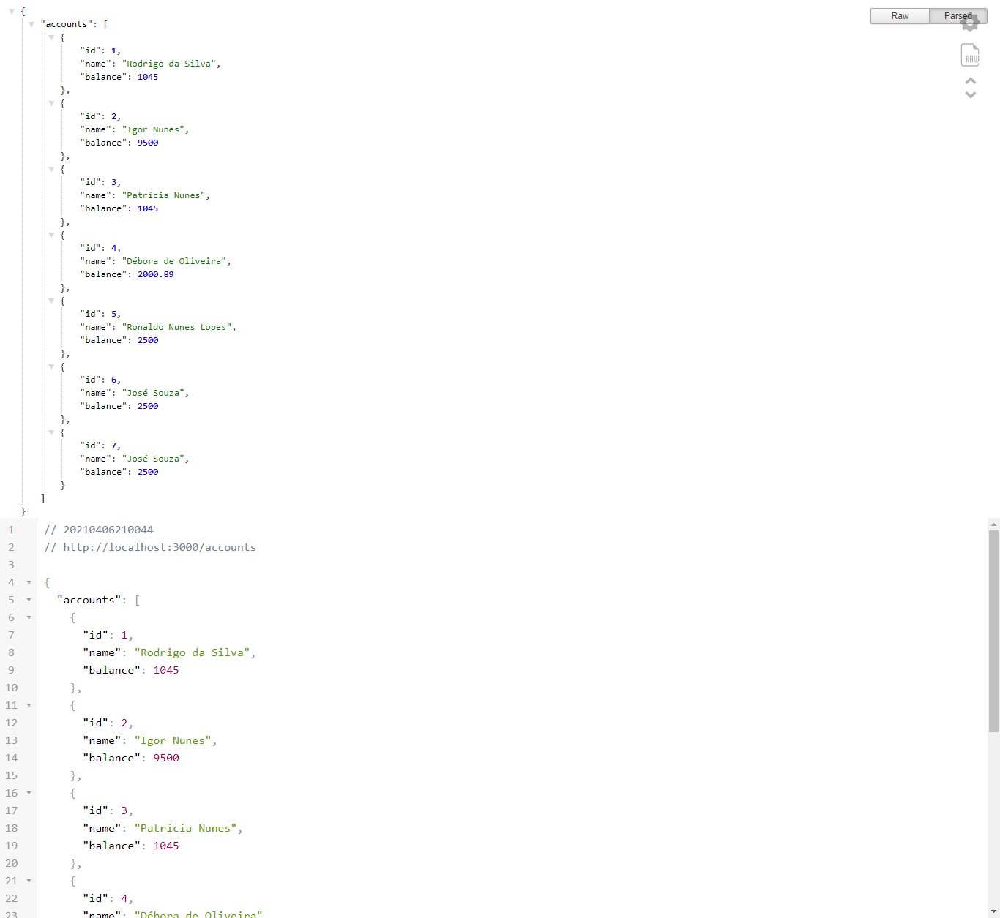

# my-bank-api
A Bootacamp IGTI exercise using Node.js and Express.

### get started
install dependencies<br/>
```npm install```

tart server<br/>
```nodemon index.js```

### Documentation

URL: <http://localhost:3000/doc>


<br/>



